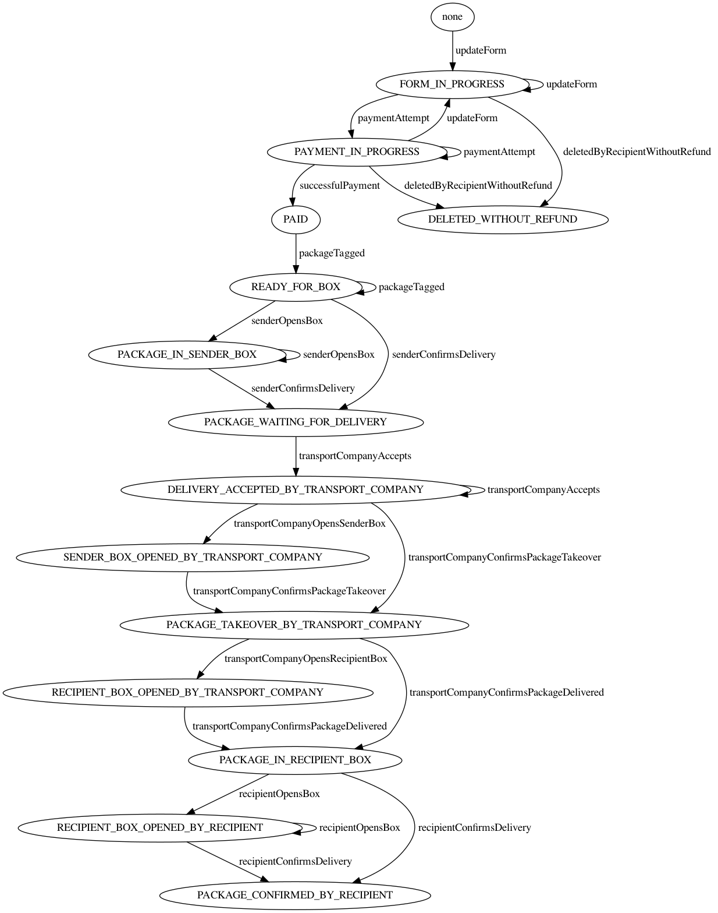
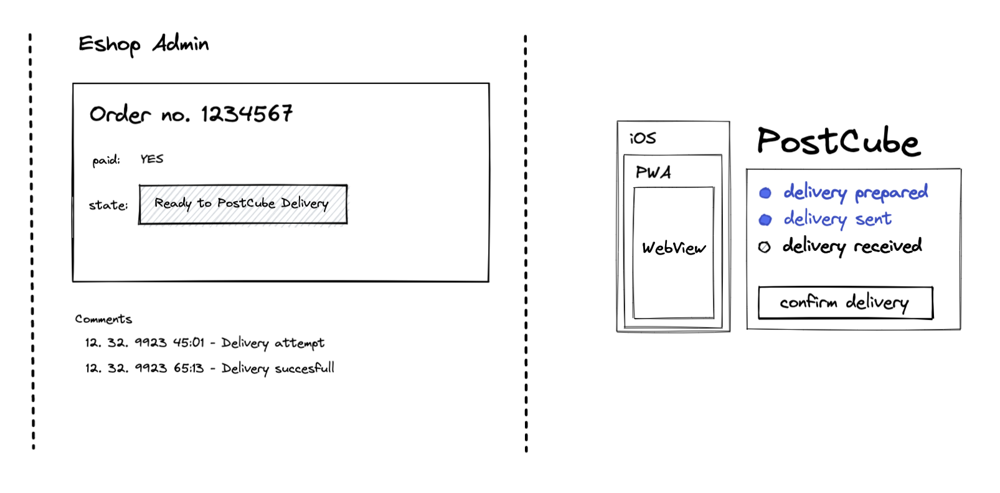
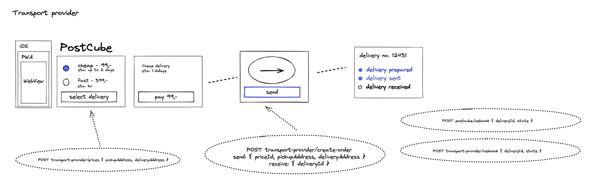

# PostCube Integration

## Aplikace

 Primárně mobilní aplikace PostCube je založená na webových technologiích. Většině uživatelů je distribuovaná v podobě instalovatelné PWA (Progressive Web App) na adrese [app.postcube.cz](https://app.postcube.cz/). Pro iOS uživatele je dostupná v [Apple Store](https://apps.apple.com/us/app/postcube/id1537386836) (veřejnou beta verzi najdete v [TestFlight](https://testflight.apple.com/join/zfgoO80t)).

### Bluetooth

Zámek PostCube schránky je aplikací ovládán pomocí [Web Bluetooth API](https://developer.mozilla.org/en-US/docs/Web/API/Web_Bluetooth_API). Na iOS, kde toto API není podporováno, je přístup k zámku zajištěn přes [cordova-plugin-ble-central](https://github.com/don/cordova-plugin-ble-central). 

Alternativně je možné zámek otevřít pomocí jednorázového kódu vygenerovaného na straně PostCube. Ten pak již jen stačí přeposlat pomocí BLE (Bluetooth Low Energy) na zařízení zámku.

**Ukázka (demo) webové aplikace pro [otevření schránky zde](https://sdk.postcube.cz/examples/unlock-device/build/)**.

## Integrace (API)

S ohledem na množství provozovatelů eshopů, platforem a dopravců jsou v PostCube vytvořeny HTTP end-pointy specificky pro každy subjekt zvlášť. Používají stejné nebo podobné funkce interně, ale na venek jsou přizpůsobeny integrované straně.

Životní cyklus zásilky je řízen FSM (Finite State Machine)místem, kterému podléhá integrovaná strana stejně jako PostCube.  

## Eshop

Jednou z funkcí PostCube je doprava zboží nakoupného na eshopu, přímo do vaší schránky před domem.

Typicky zákazník vybere PostCube jako jeden ze způsobů dopravy a zadá pouze číslo (ID) boxu s telefonním číslem majitele. Ostatní kontaktní informace se v posledním kroku košíku vyplní automaticky.

PostCube dopravce vyráží pro objednané zboží, jakmile je objednávka uhrazena a provozovatelem eshopu označena jako "Připravena k odeslání". 
O změnách stavu doručení je zákazník  informován ve své aplikaci a provozovatel eshopu ve své administraci.

## Dopravce

Integrace s poskytovatelem dopravy se skládá ze dvou end-pointu a dvou webhooků.

### Strana dopravce
1. POST na `transport-provider/prices` pro zjištění seznamu nabízených doprav a jejich cen.
    * Na EP je odeslána `pickup` a `delivery` adresa. Dopravce se na základě těchto bodů rozhodne, které (a zda nějaké) dopravy pro tuto trasu nabízí. 
    * EP vrací seznam cen s jejich identifikátory, vybraný je poté odeslán při vytváření objednávky.
    
2. POST na `transport-provider/create-order` pro vytvoření objednávky na dopravu. 
    * Odesílá se opět `pickup` a `delivery` adresa.
    * Odesílá se identifikátor ceny z prvního kroku.

3. POST webhook pro aktualizaci stavu dopravy ve chvíli, kdy je zásilka v rukou zákazníka PostCube (např. potvrzení o příjmu zásilky).

### Strana PostCube
1. POST webhook pro aktualizaci stavu dopravy ve chvíli, kdy je zásilka v rukou dopravce (např. doručujeme + ETA). 

